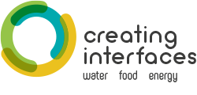

# Visualizing Water-Food-Energy Nexus

<!-- badges: start -->

[](https://github.com/IGSD-UoW/wfenexus/actions)

<!-- badges: end -->

An open source prototype for a visual interface to support research and Nexus engagements, designed collaborativelly as part of [Creating interfaces](https://creatinginterfaces.eifer.kit.edu/)' WP4.



## Online demos

* Food in Kindergartens, Slupsk (Poland): [Dashboard](https://igsd-uow.github.io/wfenexus_demo/slupsk/slupsk_dashboard.html#overview)
* Food waste, Wilmington (USA):  [Scrollytelling](https://igsd-uow.github.io/wfenexus_demo/wilmington/infographics.html)
* Local producers, Tulcea (Romania): [Interactive map](https://igsd-uow.github.io/wfenexus_demo/tulcea/tulcea_dashboard.html)

## Installation

1.  Clone this repo: `git clone git@github.com:IGSD-UoW/wfenexus.git`
2.  Install `renv` package if not already installed (`remotes::install_github("rstudio/renv")`).
3.  Run `renv::restore()` to restore the state of your project from `renv.lock` file.

### Notes

This repo has been configured to use some best practices for reproducible science:

1.  [`renv`](https://rstudio.github.io/renv/articles/renv.html) to manage isolated environments with required dependencies and versions [+info](https://rstudio.github.io/renv/).
2.  Repo as a Package [+info](https://support.rstudio.com/hc/en-us/articles/200486488-Developing-Packages-with-RStudio)

## Troubleshooting

If facing issues installing packages from Windows, run this command. (more info [in `renv` documentation](https://rstudio.github.io/renv/articles/renv.html#downloads-1), [in this discussion](https://community.rstudio.com/t/cant-install-packages-with-renv/96696/6) and [this question in SO](https://stackoverflow.com/questions/67228070/renvrestore-always-fails-in-windows))

``` r
Sys.setenv(RENV_DOWNLOAD_METHOD = "wininet")
#Sys.setenv(RENV_DOWNLOAD_METHOD = "libcurl")
```

## Datasets

This package uses the following datasets:

-   [Water footprint](https://waterfootprint.org/en/resources/waterstat/product-water-footprint-statistics/):

    -   <https://foodprint.org/issues/the-water-footprint-of-food/>
    -   <https://www.waterfootprint.org/media/downloads/Hoekstra-2008-WaterfootprintFood.pdf>
